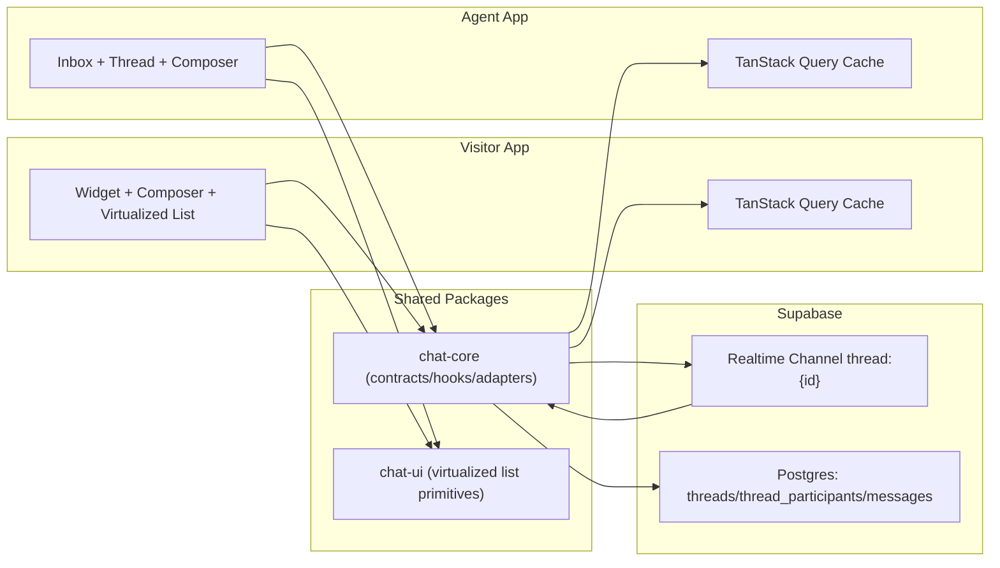

# MiniCom - Visitor + Agent Live Chat (Monorepo)

MiniCom is a two-app live support demo built with Next.js App Router, Zustand, Tailwind CSS, TanStack Query, TanStack Virtual, and Supabase Realtime/Postgres.

## Project Overview

- `apps/visitor`: mock marketing site with bottom-right chat widget.
- `apps/agent`: standalone inbox + thread responder UI.
- `packages/chat-core`: shared contracts, Supabase adapters, liveness + typing hooks, query keys, message merge helpers.
- `packages/chat-ui`: shared message bubble + virtualized message list.
- `supabase/migrations`: SQL schema for threads, participants, messages.

Core features implemented:

- Cross-app realtime messaging (visitor <-> agent)
- Optimistic send + idempotent retry (`(thread_id, client_id)` unique)
- Out-of-order-safe deterministic sort `(createdAt, seq, id)`
- Delivery states (`sending`, `sent`, `failed`)
- Debounced typing (`300ms`) + idle stop (`3s`)
- Liveness gating (`channel SUBSCRIBED` + heartbeat freshness)
- Virtualized message history + top auto-fetch for older pages
- Keyboard navigation and ARIA labels for major controls
- Offline banner + error boundary fallback

## Architecture Diagram (Text)



## State Management Choices and Trade-offs

- Hybrid approach:
  - TanStack Query is the canonical cache for server state, pagination, and mutations.
  - Zustand stores in `chat-core` hold client chat-session state (optimistic/realtime/liveness/selection).
- Trade-offs:
  - Query keeps reliable invalidation and pagination behavior.
  - Zustand centralizes cross-component chat transitions and reduces hook-local state complexity.
  - Realtime + paged merge still requires explicit dedupe (`mergeMessages`) to avoid overlap duplicates.

## Data Model

Migration: `supabase/migrations/20260225163000_minicom_chat_schema.sql`

Tables:

- `threads(id, status, created_at, updated_at)`
- `thread_participants(thread_id, participant_id, role, last_read_at)`
- `messages(id, client_id, thread_id, sender_id, body, created_at, seq)`

Constraints/Indexes:

- Unique `(thread_id, client_id)` for idempotent optimistic retry.
- Cursor index `(thread_id, created_at desc, seq desc, id desc)`.

Presence/heartbeat:

- Supabase Realtime Presence metadata (`channel.track`) every 8s.
- Liveness TTL 20s.

## Typing + Liveness Contract

- No immediate typing emit on first keystroke.
- `typing=true` after 300ms debounce.
- `typing=false` after 3s inactivity.
- On send, typing is force-stopped.
- Typing emits are suppressed when offline or liveness fails.
- Liveness requires:
  - browser online
  - channel status `SUBSCRIBED`
  - latest heartbeat age `<= 20s`

## Workspace Structure

```txt
apps/
  visitor/
  agent/
packages/
  chat-core/
  chat-ui/
supabase/
  migrations/
```

## Local Setup

1. Install deps:

```bash
pnpm install
```

2. Configure envs for both apps:

```bash
# apps/visitor/.env.local
NEXT_PUBLIC_SUPABASE_URL=...
NEXT_PUBLIC_SUPABASE_ANON_KEY=...
NEXT_PUBLIC_SUPABASE_REALTIME_VSN=1.0.0

# apps/agent/.env.local
NEXT_PUBLIC_SUPABASE_URL=...
NEXT_PUBLIC_SUPABASE_ANON_KEY=...
NEXT_PUBLIC_SUPABASE_REALTIME_VSN=1.0.0
```

3. Run SQL migration in your Supabase project.
4. Start both apps:

```bash
pnpm dev
```

Default dev URLs:

- Visitor: `http://localhost:3000`
- Agent: `http://localhost:3001`

### Realtime Troubleshooting

If both apps stay on `Service reconnecting`, verify realtime protocol compatibility:

```bash
# apps/visitor/.env.local and apps/agent/.env.local
NEXT_PUBLIC_SUPABASE_REALTIME_VSN=1.0.0
```

Then restart both dev servers. You can opt into `2.0.0` later if your Supabase project supports it.

## Scripts

- `pnpm dev`: run visitor + agent in parallel
- `pnpm dev:visitor`
- `pnpm dev:agent`
- `pnpm test`
- `pnpm build`
- `pnpm deploy`: deploy to Vercel (interactive)

## Deployment

### Prerequisites

- [Vercel CLI](https://vercel.com/docs/cli) installed globally: `npm i -g vercel`
- Vercel account and authentication: `vercel login`
- Supabase project with migrations applied

### Interactive Deployment

Deploy both apps to Vercel with a single command:

```bash
pnpm deploy
```

This interactive script will:

1. ✅ Check prerequisites (Node.js, pnpm, Vercel CLI)
2. ✅ Verify Vercel authentication
3. 🔨 Build shared packages (`chat-core`, `chat-ui`)
4. ⚙️ Prompt for project configuration:
   - Vercel project names (defaults: `minicom-visitor`, `minicom-agent`)
   - Custom domains (optional)
5. 🔗 Create or link Vercel projects
6. 🔐 Sync environment variables from `.env.local` files
7. 📋 Show deployment summary and ask for confirmation
8. 🚀 Deploy apps to production

### Manual Deployment (Alternative)

If you prefer to deploy manually:

```bash
# Deploy visitor app
cd apps/visitor
vercel --prod

# Deploy agent app
cd apps/agent
vercel --prod
```

### Domain Configuration

After deployment, configure custom domains in your Vercel dashboard:

1. Visit [vercel.com/dashboard](https://vercel.com/dashboard)
2. Select your project
3. Go to **Settings** → **Domains**
4. Add your custom domain (e.g., `visitor.yourdomain.com`)
5. Follow DNS configuration instructions

**Note:** Both apps must be on separate domains since they are standalone Next.js applications.

### Environment Variables

The deployment script automatically syncs environment variables from `.env.local` files. Ensure these are set before deploying:

```bash
# Required for both apps
NEXT_PUBLIC_SUPABASE_URL=https://your-project.supabase.co
NEXT_PUBLIC_SUPABASE_ANON_KEY=your-anon-key
NEXT_PUBLIC_SUPABASE_REALTIME_VSN=1.0.0
```

To manually update environment variables after deployment:

```bash
cd apps/visitor
vercel env add NEXT_PUBLIC_SUPABASE_URL production

cd apps/agent
vercel env add NEXT_PUBLIC_SUPABASE_URL production
```

## CI/CD (Future Improvements)

For production use, consider implementing automated CI/CD:

### GitHub Actions Workflow

Create `.github/workflows/deploy.yml`:

```yaml
name: Deploy to Vercel

on:
  push:
    branches: [main]
  pull_request:
    branches: [main]

jobs:
  deploy:
    runs-on: ubuntu-latest
    steps:
      - uses: actions/checkout@v4

      - name: Setup Node.js
        uses: actions/setup-node@v4
        with:
          node-version: "22"

      - name: Setup pnpm
        uses: pnpm/action-setup@v2
        with:
          version: 8.15.1

      - name: Install dependencies
        run: pnpm install

      - name: Build shared packages
        run: pnpm build

      - name: Deploy Visitor App
        working-directory: apps/visitor
        run: vercel --prod --token=${{ secrets.VERCEL_TOKEN }}
        env:
          VERCEL_ORG_ID: ${{ secrets.VERCEL_ORG_ID }}
          VERCEL_PROJECT_ID: ${{ secrets.VERCEL_VISITOR_PROJECT_ID }}

      - name: Deploy Agent App
        working-directory: apps/agent
        run: vercel --prod --token=${{ secrets.VERCEL_TOKEN }}
        env:
          VERCEL_ORG_ID: ${{ secrets.VERCEL_ORG_ID }}
          VERCEL_PROJECT_ID: ${{ secrets.VERCEL_AGENT_PROJECT_ID }}
```

### Recommended CI/CD Setup

1. **Preview Deployments**: Enable automatic preview deployments for pull requests
2. **Staging Environment**: Create staging projects (`minicom-visitor-staging`, `minicom-agent-staging`)
3. **Environment Branching**:
   - `main` branch → Production
   - `staging` branch → Staging environment
   - PR branches → Preview deployments
4. **Automated Testing**: Run test suite before deployment
5. **Environment Variable Management**: Use Vercel's environment variable UI or Terraform

### Required GitHub Secrets

Add these secrets to your GitHub repository:

- `VERCEL_TOKEN` - Vercel personal access token
- `VERCEL_ORG_ID` - Your Vercel organization ID
- `VERCEL_VISITOR_PROJECT_ID` - Visitor app project ID
- `VERCEL_AGENT_PROJECT_ID` - Agent app project ID

## Tests

Current automated tests are in `packages/chat-core`:

- Typing debounce test (`300ms`)
- Typing idle stop test (`3s`)
- Liveness TTL/service-live gating test
- Message dedupe + deterministic order test

## How AI Helped


Model used: codex, GBT-5.3, kimi k2

AI was used for scaffolding and refactoring assistance.

Example prompts used:

- "Split this single Next app into visitor and agent standalone apps in a pnpm workspace monorepo."
- "Implement TanStack Virtual message list with prepend anchor preservation and jump-to-latest behavior."
- "Implement typing signal controller with 300ms debounce, 3s idle, and liveness gating."

Manual edits after AI output:

- tightened Supabase repository contracts
- aligned query keys and message identity model
- simplified inbox sort behavior and keyboard handling
- added migration SQL and README architecture details


- Some specs are in the specs folder for enforcing good practices for the app.

## Improvements With More Time

- Replace the design with some better tailwind ui libary
- Replace the sql dummy validation with backend one
- Add Playwright cross-app E2E for full visitor<->agent flow.
- Add read-receipt UI details and stronger unread accuracy via SQL views.
- Improve reconnect handling with exponential backoff and richer channel telemetry.
- Add notifications sounds
- Add server-side auth for agent identity and visitor anonymous auth tokens.
- **CI/CD Pipeline**: Implement automated deployments with GitHub Actions (see CI/CD section above).
- **Environment Management**: Add staging environment with automated promotion to production.
- Check memory consumption and optimize for low-end devices and test how the app performs over times if there are any memory leaks.

## Submission Checklist

- GitHub repo link: _to be added_
- Live demo link: 
  - visit https://minicom-visitor.vercel.app/
  - agent https://minicom-agent.vercel.app/
